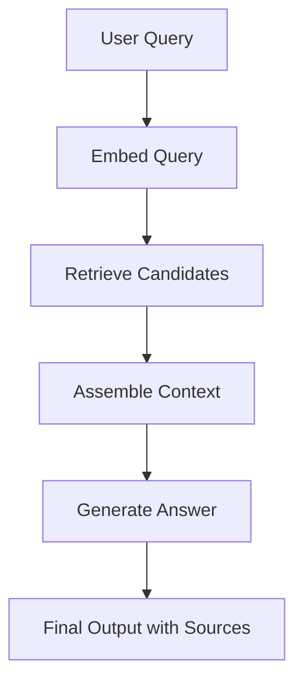

# RAG Pipeline Architecture & Flow Design

This document describes the full query-to-answer architecture for our Retrieval-Augmented Generation (RAG) system.

## Flow Diagram

## Detailed Stage Description

1. **Embed Query (`embed_query`)**
   - **Input:** Raw user query string.
   - **Process:** Calls the embedding model (e.g., text-embedding-3-small) to convert the user's text into a dense vector representation. This allows semantic matching against the knowledge base.
   - **Output:** Dense vector array representing the query.

2. **Retrieve Candidates (`retrieve_context`)**
   - **Input:** Query vector array.
   - **Process:** Queries the vector database (e.g., Qdrant) using the dense vector to perform a top-k similarity search (Cosine similarity). Retrieves the most relevant knowledge base chunks along with their metadata.
   - **Output:** List of retrieved documents/chunks.

3. **Assemble Context (`assemble_prompt`)**
   - **Input:** Retrieved documents and original user query.
   - **Process:** Formats the retrieved text snippets into a structured prompt. This step injects the grounded knowledge into a system prompt, instructing the LLM to use *only* this context to answer the query. It may also prepend structural instructions.
   - **Output:** Final, fully constructed prompt string ready for the LLM.

4. **Generate Answer (`generate_answer`)**
   - **Input:** Assembled prompt.
   - **Process:** Calls the generation LLM (e.g., gpt-3.5-turbo or gpt-4o) using the assembled prompt. The model processes the injected context and produces a coherent, factually grounded response.
   - **Output:** The generated answer string and a list of the sources used to formulate it.
